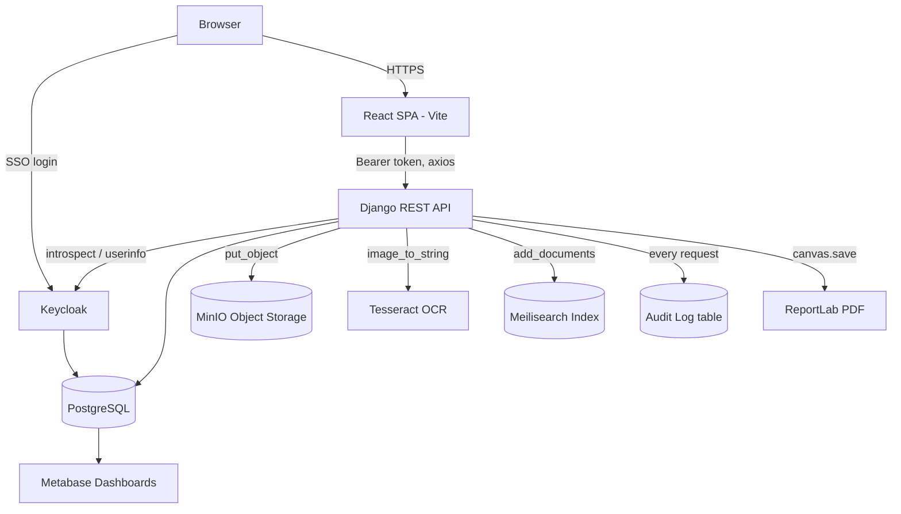

# NAAC Data Management & Accreditation Support System

A Django + React platform for colleges to collect, store, search, and report on NAAC accreditation evidence.

## What this does

Institutions upload evidence documents (PDFs/images) against NAAC's seven accreditation criteria. The backend runs OCR on each file, stores the original in object storage, and indexes the extracted text for full-text search. IQAC/department admins can approve evidence and generate criterion-wise PDF reports. Every authenticated request is logged for audit purposes, and login/roles are handled through Keycloak SSO.

## Key Features

- **Keycloak SSO** — OIDC login via `keycloak-js` on the frontend and token introspection on the backend, with JWT session tokens issued after login
- **Role-based access** — four roles (IQAC Admin, Department Admin, Faculty, Student) enforced on the `Task` endpoints; other endpoints require authentication only
- **Evidence & document upload** — files are stored in MinIO, OCR'd with Tesseract, and text-indexed in Meilisearch on upload
- **Full-text document search** — queries Meilisearch and resolves hits back to `Document` rows
- **Document approval workflow** — admins mark documents approved before they're included in generated reports
- **Criterion-wise PDF reports** — generated on demand with ReportLab from approved documents
- **Audit logging** — a middleware logs every authenticated request (path, IP, user agent), plus explicit log entries for uploads, searches, approvals, and report generation
- **Task management (backend only)** — assignment and tracking of accreditation-related tasks, scoped by role; no frontend page consumes this yet
- **Metabase dashboards** — Metabase is wired up against the same Postgres instance with Keycloak OIDC login, for ad hoc analytics

## Architecture



Request flow for a document upload: the React SPA sends the file with a Keycloak-issued bearer token → `DocumentUploadView` validates it, pushes the file to MinIO, runs Tesseract OCR on it, creates the `Document` row in Postgres, indexes the OCR text in Meilisearch, and writes an `AuditLog` entry — all in one request.

## Tech Stack

| Category | Tool |
|---|---|
| Frontend | React 18 (Vite), React Router, Axios, Tailwind CSS, react-hook-form |
| Auth | Keycloak (OIDC), `keycloak-js`, `@react-keycloak/web`, `djangorestframework-simplejwt`, `python-keycloak` |
| Backend | Django 4.2, Django REST Framework |
| Database | PostgreSQL 15 |
| Object Storage | MinIO |
| Search | Meilisearch v1.3 |
| OCR | Tesseract (`pytesseract`), Pillow, OpenCV |
| PDF Reports | ReportLab |
| Analytics | Metabase v0.46.6 |
| Containerization | Docker, Docker Compose |

## Setup / Installation

> **Note:** `docker-compose.yml` currently has unresolved merge-conflict markers checked in. Resolve those before running the commands below (the two conflicting sides are identical, so it's a straightforward cleanup).

### With Docker (recommended)

```bash
git clone https://github.com/Sohan-dsz/Cloud-Based-Naac-Data-Management-System.git
cd Cloud-Based-Naac-Data-Management-System
cp .env.example .env   # edit values as needed
docker-compose up --build
```

In a second terminal, once the backend container is up:

```bash
docker-compose exec backend python manage.py migrate
docker-compose exec backend python manage.py createsuperuser
```

Then configure Keycloak:
1. Open `http://localhost:8080`, log in with `admin` / `admin`
2. Import `keycloak-realm-config.json` as the realm config

Services once running:

| Service | URL |
|---|---|
| Frontend | http://localhost:5174 |
| Backend API | http://localhost:8000 |
| Keycloak | http://localhost:8080 |
| MinIO Console | http://localhost:9001 |
| Meilisearch | http://localhost:7700 |
| Metabase | http://localhost:3001 |

### Without Docker (local dev)

**Backend**
```bash
cd backend
pip install -r requirements.txt
python manage.py migrate
python manage.py runserver
```

**Frontend**
```bash
cd frontend
npm install
npm run dev
```

You'll still need Postgres, Keycloak, MinIO, and Meilisearch reachable at the hosts/ports set in your `.env` — the app doesn't run without them since `DocumentUploadView` talks to MinIO, Meilisearch, and Postgres directly.

## Usage Example

Upload a document (as an authenticated user):

```bash
curl -X POST http://localhost:8000/api/documents/documents/upload/ \
  -H "Authorization: Bearer <access_token>" \
  -F "title=Faculty Research Policy" \
  -F "evidence_id=3" \
  -F "file=@research_policy.pdf"
```

Response:

```json
{
  "id": 12,
  "title": "Faculty Research Policy",
  "description": "",
  "file_path": "research_innovations_extension/3/research_policy.pdf",
  "file_size": 204800,
  "mime_type": "application/pdf",
  "evidence": {
    "id": 3,
    "title": "Research Policy Evidence",
    "criteria": { "id": 3, "name": "research_innovations_extension", "description": "", "weightage": "10.00" },
    "created_by": 1,
    "created_at": "2026-09-11T08:12:00Z",
    "updated_at": "2026-09-11T08:12:00Z",
    "document_count": 1
  },
  "uploaded_by": "sohan",
  "uploaded_at": "2026-09-11T08:14:22Z",
  "version": 1,
  "ocr_text": "...",
  "is_approved": false,
  "approved_by": null,
  "approved_at": null
}
```

Search indexed documents:

```bash
curl -H "Authorization: Bearer <access_token>" \
  "http://localhost:8000/api/documents/documents/search/?q=research+policy"
```

Generate a criterion report (returns a PDF):

```bash
curl -H "Authorization: Bearer <access_token>" \
  "http://localhost:8000/api/reports/naac/research_innovations_extension/" \
  --output report.pdf
```

## Folder Structure

```
.
├── backend/
│   ├── apps/
│   │   ├── authentication/   # User/Role models, Keycloak + JWT login
│   │   ├── documents/        # Criteria, Evidence, Document, upload/search/approve
│   │   ├── reports/          # PDF report generation (ReportLab)
│   │   ├── audit/            # AuditLog model + request-logging middleware
│   │   └── tasks/            # Task assignment (backend only, no UI yet)
│   ├── naac_system/          # Django project settings, urls, wsgi/asgi
│   ├── manage.py
│   └── requirements.txt
├── frontend/
│   ├── src/
│   │   ├── components/       # Login, UploadForm, EvidenceDashboard, Analytics, ReportDownload
│   │   ├── App.jsx           # Routes + Keycloak provider + axios interceptors
│   │   └── main.jsx
│   └── package.json
├── config/
│   ├── nginx.conf            # present, not wired into docker-compose.yml
│   └── init-db.sql           # present, not wired into docker-compose.yml
├── docker-compose.yml
├── keycloak-realm-config.json
└── .env.example
```

## Environment Variables

From `.env.example`:

| Variable | Description |
|---|---|
| `DJANGO_SETTINGS_MODULE` | Django settings module path |
| `DEBUG` | Django debug mode |
| `SECRET_KEY` | Django secret key |
| `ALLOWED_HOSTS` | Comma-separated allowed hosts |
| `POSTGRES_DB` / `POSTGRES_USER` / `POSTGRES_PASSWORD` | Main app database credentials |
| `POSTGRES_HOST` / `POSTGRES_PORT` | Main app database connection |
| `KEYCLOAK_SERVER_URL` | Keycloak base URL |
| `KEYCLOAK_REALM` | Keycloak realm name |
| `KEYCLOAK_CLIENT_ID` / `KEYCLOAK_CLIENT_SECRET` | Keycloak client credentials |
| `MINIO_ENDPOINT` | MinIO host:port |
| `MINIO_ACCESS_KEY` / `MINIO_SECRET_KEY` | MinIO credentials |
| `MINIO_SECURE` | Whether to use HTTPS for MinIO |
| `MINIO_BUCKET_NAME` | Bucket used for document storage |
| `MEILISEARCH_URL` | Meilisearch base URL |
| `MEILISEARCH_MASTER_KEY` | Meilisearch admin key |
| `METABASE_URL` | Metabase base URL |
| `CORS_ALLOWED_ORIGINS` | Allowed frontend origins |

## Author

**Sohan D Souza**
