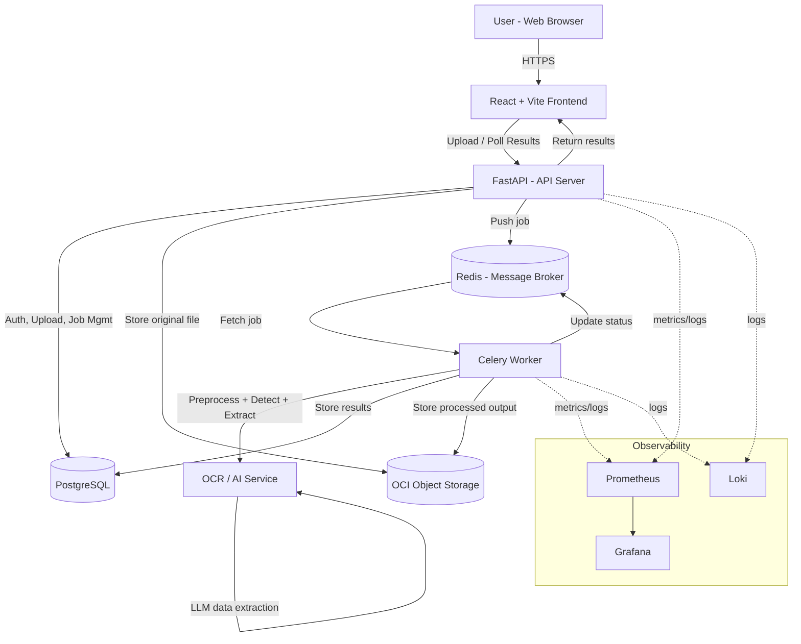

<div align="center">

# 📄 AI-Powered Document Understanding System

### An asynchronous, containerized pipeline that turns uploaded documents into structured, searchable data

[](#)
[](#)
[](#)
[](#)
[](#)
[](#)

Document upload&nbsp;•&nbsp;Async OCR & AI extraction&nbsp;•&nbsp;Object storage&nbsp;•&nbsp;CI/CD&nbsp;•&nbsp;Observability

</div>

---

## 📑 Table of Contents

- [What This Does](#-what-this-does)
- [Key Features](#-key-features)
- [Architecture](#-architecture)
- [System Workflow](#-system-workflow)
- [Tech Stack](#-tech-stack)
- [Local Development](#-local-development)
- [Deployment & CI/CD](#-deployment--cicd)
- [Monitoring & Logging](#-monitoring--logging)
- [Why This Setup](#-why-this-setup)
- [Author](#-author)

---

## 🧠 What This Does

A user uploads a document through the React frontend. FastAPI validates it, stores the original in object storage, and pushes a processing job onto a Redis queue. A Celery worker picks the job up, runs it through an OCR/AI pipeline — OpenCV preprocessing, YOLOv8 field detection, EasyOCR for printed text, TrOCR for handwriting, and an LLM step for structured data extraction — and writes the results back to PostgreSQL. The frontend then polls for and displays the extracted data. The whole thing runs as a set of Docker containers, ships through a GitHub Actions CI/CD pipeline, and reports metrics and logs through Prometheus, Grafana, and Loki.

## ✨ Key Features

- **Async processing by design** — uploads return immediately; a Redis-backed Celery queue handles the actual OCR/AI work in the background so the API never blocks
- **Multi-model extraction pipeline** — OpenCV for preprocessing, YOLOv8 for field/region detection, EasyOCR for printed text, TrOCR for handwritten content, and an LLM pass to turn raw OCR output into structured fields
- **Object storage with signed URLs** — uploaded originals and processed outputs are stored in an OCI bucket, served back via signed URLs rather than direct public access
- **Job status tracking** — PostgreSQL tracks users, jobs, results, and logs/metadata, so a client can poll a job until it completes
- **Secrets kept out of the codebase** — all credentials and config are injected via `.env`, never hardcoded
- **One-command local environment** — `docker-compose up` brings up the frontend, API, broker, worker, database, and local S3-compatible storage together
- **CI/CD on every push** — GitHub Actions runs the test suite, builds Docker images, pushes to a registry, and deploys to the OCI server
- **Full observability** — Prometheus scrapes metrics, Grafana visualizes them, Loki aggregates logs, covering CPU/memory, API latency, error rate, queue length, and uptime
- **Runs entirely on free/trial tiers** — every service in the stack (OCI storage, Netlify/Cloudflare Pages hosting, GitHub Actions, Prometheus, Grafana) fits a generous free plan

## 🏗️ Architecture



## 🔄 System Workflow

1. **User uploads a document** through the React frontend
2. **FastAPI validates the request** and stores the file in object storage
3. **A job is created and pushed** to the Redis queue
4. **A Celery worker picks up the job** and begins processing
5. **The OCR/AI pipeline extracts data** — preprocessing, detection, text/handwriting recognition, and structured extraction
6. **Results are saved to PostgreSQL** and returned to the user

## 🛠️ Tech Stack

| Category | Tool |
|:---|:---|
| 🖥️ Frontend | React + Vite |
| ⚙️ API Server | FastAPI |
| 📨 Message Broker | Redis |
| 🔄 Background Jobs | Celery |
| 🧠 OCR / AI | OpenCV, YOLOv8, EasyOCR, TrOCR, LLM extraction |
| 🗄️ Database | PostgreSQL |
| 📦 Object Storage | OCI Object Storage (MinIO locally) |
| 🐳 Containerization | Docker, Docker Compose |
| 🚀 CI/CD | GitHub Actions |
| 📊 Monitoring | Prometheus, Grafana, Loki |
| ☁️ Frontend Hosting | Netlify / Cloudflare Pages |

## 💻 Local Development

> **Prerequisites:** Docker and Docker Compose installed.

```bash
git clone <repository-url>
cd ai-document-understanding-system
cp .env.example .env   # fill in secrets, never commit this file
docker-compose up --build
```

This starts six services together:

| Service | Role |
|:---|:---|
| `frontend` | React app |
| `fastapi` | API server |
| `redis` | Message broker / queue |
| `worker` | Celery background processor |
| `postgres` | Database |
| `minio` | Local S3-compatible object storage (stands in for OCI in dev) |

## 🚀 Deployment & CI/CD

Every push to `main` triggers the GitHub Actions pipeline:

```text
Push Code → Run Tests (pytest) → Build Docker Images → Push to Registry → Deploy to Server (OCI) → Application Live
```

The frontend deploys separately to Netlify or Cloudflare Pages; the backend services deploy as Docker containers to an OCI server.

## 📈 Monitoring & Logging

```text
Application → Prometheus (Metrics) → Grafana (Dashboards) → Loki (Logs)
```

Tracked continuously:
- CPU / Memory usage
- API latency
- Error rate
- Queue length
- Uptime

## 🎯 Why This Setup

- **Fully containerized** — portable and scalable, every service isolated
- **Asynchronous processing** — the API stays responsive while heavy OCR/AI work happens in the background
- **Secure file storage** — originals and outputs live in object storage behind signed URLs, not the app server
- **Production-ready** — CI/CD plus full observability, not just a local script
- **Cost-efficient** — runs entirely on free/trial tiers of every service used
- **Environment-based secrets** — nothing sensitive is hardcoded into the codebase

## 👨‍💻 Author

**Sohan D Souza**

Full Stack Developer • AI/ML Enthusiast
