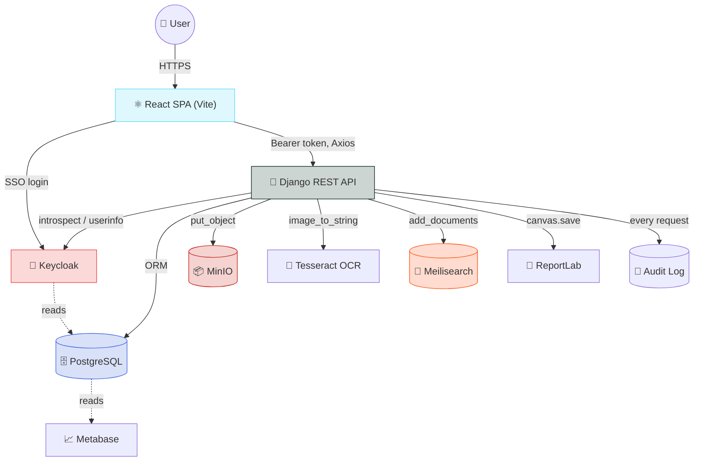
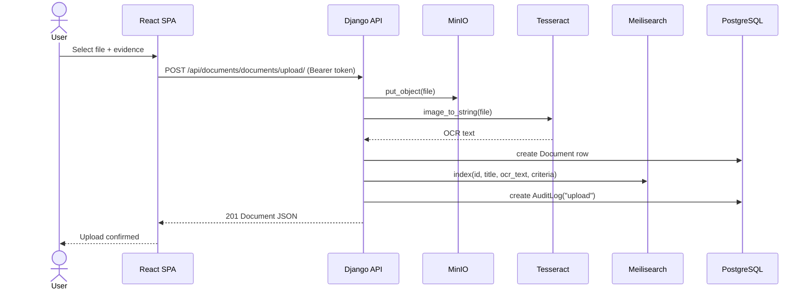

<div align="center">

# 🎓 NAAC Data Management & Accreditation Support System

### A Django + React platform for collecting, indexing, and reporting on NAAC accreditation evidence

[](#)
[](#)
[](#)
[](#)
[](#)
[](#)

<br>

Document upload & OCR&nbsp;•&nbsp;Full-text search&nbsp;•&nbsp;Role-based access&nbsp;•&nbsp;Approval workflow&nbsp;•&nbsp;Audit logging&nbsp;•&nbsp;PDF reports&nbsp;•&nbsp;Analytics dashboards

</div>

---

## 📑 Table of Contents

- [What This Does](#-what-this-does)
- [Key Features](#-key-features)
- [System Architecture](#️-system-architecture)
- [Document Upload Flow](#-document-upload-flow)
- [Tech Stack](#️-tech-stack)
- [Project Structure](#-project-structure)
- [Quick Start](#-quick-start)
- [Application URLs](#-application-urls)
- [API Endpoints](#-api-endpoints)
- [Local Development (No Docker)](#-local-development-no-docker)
- [Environment Variables](#-environment-variables)
- [Security Notes](#-security-notes)
- [Known Limitations](#-known-limitations)
- [Author](#-author)

---

## 🧠 What This Does

Institutions upload evidence documents against NAAC's seven accreditation criteria. Django runs OCR on each upload, stores the original in MinIO, and indexes the extracted text in Meilisearch for full-text search. IQAC/department admins approve evidence and generate criterion-wise PDF reports. Every authenticated request is written to an audit log, and login/roles are handled through Keycloak SSO.

---

## ✨ Key Features

<table>
<tr>
<td width="50%" valign="top">

### 🔐 Authentication & Authorization
- Keycloak-based SSO (OIDC)
- JWT session tokens via `djangorestframework-simplejwt`
- Four roles: IQAC Admin, Department Admin, Faculty, Student
- Role-based permissions enforced on the Task endpoints

</td>
<td width="50%" valign="top">

### 📁 Document Management
- Criteria → Evidence → Document hierarchy
- File uploads stored in MinIO object storage
- Version field on each document
- Approval workflow (admin sign-off before reporting)

</td>
</tr>
<tr>
<td width="50%" valign="top">

### 🔍 Search & OCR
- Tesseract OCR runs on every upload
- OCR text indexed into Meilisearch
- Full-text search resolves hits back to document rows

</td>
<td width="50%" valign="top">

### 📊 Reporting & Analytics
- Criterion-wise PDF reports via ReportLab
- Only approved documents included
- Metabase dashboards on the same Postgres instance

</td>
</tr>
<tr>
<td width="50%" valign="top">

### 📝 Audit Logging
- Middleware logs every authenticated request
- Explicit log entries for upload, search, approve, report actions
- Tracks user, IP, and user agent

</td>
<td width="50%" valign="top">

### ✅ Task Management (backend only)
- Task model with assignment + status
- Role-scoped visibility (admins see all, others see their own)
- No frontend page consumes this yet

</td>
</tr>
</table>

---

## 🏗️ System Architecture



---

## 🔄 Document Upload Flow



---

## 🛠️ Tech Stack

<div align="center">

| Layer | Technology |
|:---|:---|
| 🖥️ **Frontend** | React 18 · Vite · React Router · Axios · Tailwind CSS · react-hook-form |
| 🔐 **Auth** | Keycloak (OIDC) · `keycloak-js` · `@react-keycloak/web` · SimpleJWT |
| ⚙️ **Backend** | Django 4.2 · Django REST Framework · Python 3.11 |
| 🗄️ **Database** | PostgreSQL 15 |
| 📦 **Object Storage** | MinIO |
| 🔎 **Search Engine** | Meilisearch v1.3 |
| 🔡 **OCR** | Tesseract (`pytesseract`) · Pillow · OpenCV |
| 📄 **PDF Reports** | ReportLab |
| 📈 **Analytics** | Metabase v0.46.6 |
| 🐳 **Containerization** | Docker · Docker Compose |

</div>

---

## 📂 Project Structure

```bash
.
├── backend/
│   ├── apps/
│   │   ├── authentication/   # User/Role models, Keycloak + JWT login
│   │   ├── documents/        # Criteria, Evidence, Document, upload/search/approve
│   │   ├── reports/          # PDF report generation (ReportLab)
│   │   ├── audit/            # AuditLog model + request-logging middleware
│   │   └── tasks/            # Task assignment (backend only, no UI yet)
│   ├── naac_system/          # Django settings, urls, wsgi/asgi
│   ├── manage.py
│   └── requirements.txt
├── frontend/
│   ├── src/
│   │   ├── components/       # Login, UploadForm, EvidenceDashboard, Analytics, ReportDownload
│   │   ├── App.jsx           # Routes + Keycloak provider + axios interceptors
│   │   └── main.jsx
│   └── package.json
├── config/
│   ├── nginx.conf            # present, not wired into docker-compose.yml
│   └── init-db.sql           # present, not wired into docker-compose.yml
├── docker-compose.yml
├── keycloak-realm-config.json
└── .env.example
```

---

## 🚀 Quick Start

> **Prerequisites:** Docker, Docker Compose, and Git.
> ```bash
> docker --version
> docker-compose --version
> git --version
> ```
>
> ⚠️ `docker-compose.yml` currently has unresolved git merge-conflict markers checked in — resolve those before step 3 (both sides are identical, so it's a quick cleanup).

<details open>
<summary><strong>Step 1 — Clone the repository</strong></summary>

```bash
git clone https://github.com/Sohan-dsz/Cloud-Based-Naac-Data-Management-System.git
cd Cloud-Based-Naac-Data-Management-System
```
</details>

<details open>
<summary><strong>Step 2 — Configure environment variables</strong></summary>

```bash
cp .env.example .env
```
Fill in the values — see [Environment Variables](#-environment-variables) below.
</details>

<details open>
<summary><strong>Step 3 — Start all services</strong></summary>

```bash
docker-compose up --build
```
</details>

<details open>
<summary><strong>Step 4 — Apply database migrations</strong></summary>

In a new terminal:
```bash
docker-compose exec backend python manage.py migrate
```
</details>

<details open>
<summary><strong>Step 5 — Create an admin user</strong></summary>

```bash
docker-compose exec backend python manage.py createsuperuser
```
</details>

<details open>
<summary><strong>Step 6 — Configure Keycloak</strong></summary>

1. Open **http://localhost:8080**
2. Sign in with `admin` / `admin`
3. Import the realm config: `keycloak-realm-config.json`
</details>

<details open>
<summary><strong>Step 7 — Connect Metabase</strong></summary>

1. Open **http://localhost:3001**
2. Connect Metabase to the `naac_db` PostgreSQL instance
3. Build dashboards on top of `Document`, `Evidence`, and `AuditLog` tables
</details>

---

## 🌐 Application URLs

| Service | URL |
|:---|:---|
| 🖥️ Frontend | http://localhost:5174 |
| ⚙️ Backend API | http://localhost:8000 |
| 🔐 Keycloak | http://localhost:8080 |
| 📦 MinIO Console | http://localhost:9001 |
| 🔎 Meilisearch | http://localhost:7700 |
| 📈 Metabase | http://localhost:3001 |

---

## 📚 API Endpoints

<details>
<summary><strong>🔐 Authentication</strong></summary>

```http
POST /api/auth/login/
POST /api/auth/keycloak-login/
GET  /api/auth/profile/
GET  /api/auth/roles/
```
</details>

<details>
<summary><strong>📁 Documents</strong></summary>

```http
GET  /api/documents/criteria/
GET  /api/documents/evidence/
POST /api/documents/evidence/
GET  /api/documents/documents/
POST /api/documents/documents/upload/
GET  /api/documents/documents/search/?q=<query>
POST /api/documents/documents/<id>/approve/
```
</details>

<details>
<summary><strong>📄 Reports</strong></summary>

```http
GET /api/reports/naac/<criteria_name>/
```
</details>

<details>
<summary><strong>📝 Audit</strong></summary>

```http
GET /api/audit/logs/
```
</details>

<details>
<summary><strong>✅ Tasks</strong></summary>

```http
GET  /api/tasks/
POST /api/tasks/
GET  /api/tasks/<id>/
GET  /api/tasks/my/
```
</details>

---

## 💻 Local Development (No Docker)

<table>
<tr>
<td valign="top" width="50%">

**Backend**
```bash
cd backend
pip install -r requirements.txt
python manage.py migrate
python manage.py runserver
```

</td>
<td valign="top" width="50%">

**Frontend**
```bash
cd frontend
npm install
npm run dev
```

</td>
</tr>
</table>

> You'll still need Postgres, Keycloak, MinIO, and Meilisearch reachable at the hosts/ports set in `.env` — `DocumentUploadView` talks to MinIO, Meilisearch, and Postgres directly on every upload.

---

## 🔧 Environment Variables

From `.env.example`:

| Variable | Description |
|:---|:---|
| `DJANGO_SETTINGS_MODULE` | Django settings module path |
| `DEBUG` | Django debug mode |
| `SECRET_KEY` | Django secret key |
| `ALLOWED_HOSTS` | Comma-separated allowed hosts |
| `POSTGRES_DB` / `POSTGRES_USER` / `POSTGRES_PASSWORD` | App database credentials |
| `POSTGRES_HOST` / `POSTGRES_PORT` | App database connection |
| `KEYCLOAK_SERVER_URL` | Keycloak base URL |
| `KEYCLOAK_REALM` | Keycloak realm name |
| `KEYCLOAK_CLIENT_ID` / `KEYCLOAK_CLIENT_SECRET` | Keycloak client credentials |
| `MINIO_ENDPOINT` | MinIO host:port |
| `MINIO_ACCESS_KEY` / `MINIO_SECRET_KEY` | MinIO credentials |
| `MINIO_SECURE` | Use HTTPS for MinIO |
| `MINIO_BUCKET_NAME` | Bucket used for document storage |
| `MEILISEARCH_URL` | Meilisearch base URL |
| `MEILISEARCH_MASTER_KEY` | Meilisearch admin key |
| `METABASE_URL` | Metabase base URL |
| `CORS_ALLOWED_ORIGINS` | Allowed frontend origins |

---

## 🔒 Security Notes

✅ JWT Authentication &nbsp;|&nbsp; ✅ Keycloak Token Introspection &nbsp;|&nbsp; ✅ Role-Based Permissions (Tasks) &nbsp;|&nbsp; ✅ Per-Request Audit Logging

Before deploying beyond local dev, at minimum:
- Set `DEBUG=False` and a real, unique `SECRET_KEY`
- Restrict `ALLOWED_HOSTS` and `CORS_ALLOWED_ORIGINS` to your actual domains
- Set `MINIO_SECURE=True` if MinIO/S3 is reachable over the network
- Put a real `KEYCLOAK_CLIENT_SECRET` in place instead of the empty default

---

## ⚠️ Known Limitations

- `docker-compose.yml` has unresolved git merge-conflict markers checked in (needs a manual fix before first run)
- The `tasks` app has API endpoints and permissions but no corresponding frontend UI yet
- `config/nginx.conf` and `config/init-db.sql` exist in the repo but aren't referenced by `docker-compose.yml`
- No automated test suite or CI workflow is currently configured
- No `LICENSE` file is present in the repo

---

## 👨‍💻 Author

<div align="center">

**Sohan D Souza**

Full Stack Developer • AI/ML Enthusiast • Salesforce Developer

</div>
